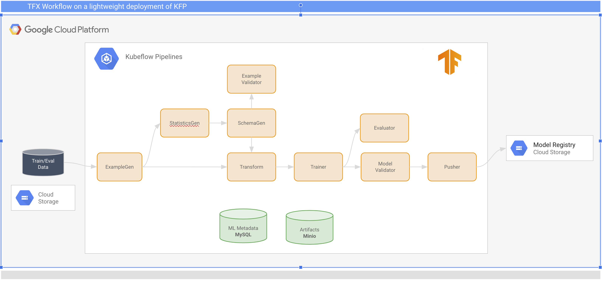

# Orchestrating model training and deployment with TFX on KFP

In this lab you will develop, deploy and run a TFX pipeline that uses Kubeflow Pipelines as an orchestrator.


## Lab scenario

You will be working with the [Covertype Data Set](https://github.com/jarokaz/mlops-labs/blob/master/datasets/covertype/README.md) dataset. 

The pipeline implements a typical TFX workflow as depicted on the below diagram:

.

The source data in a CSV file format is in the GCS bucket.

The TFX `ExampleGen`, `StatisticsGen`, `ExampleValidator`, `SchemaGen`, `Transform`, and `Evaluator` components run as KFP components.


## Lab setup

### AI Platform Notebook and KFP environment
Before proceeding with the lab, you must set up an **AI Platform Notebooks** instance and a **KFP** environment as detailed in lab-01-environment-notebook and lab-02-environment-kfp

### Lab dataset

The TFX pipeline in the lab is designed to ingest the *Covertype Data Set* in the CSV format from the GCS location. To prepare for the lab create a GCS bucket in your project and upload the file to a subfolder in the bucket.

1. Create a GCS bucket
```
PROJECT_ID=[YOUR_PROJECT_ID]
BUCKET_NAME=gs://${PROJECT_ID}-staging
gsutil mb -p $PROJECT_ID $BUCKET_NAME
```
2. Upload the *Covertype Data Set* CSV file
```
COVERTYPE_GCS_PATH=${BUCKET_NAME}/covertype_dataset/
gsutil cp gs://workshop-datasets/covertype/full/dataset.csv $COVERTYPE_GCS_PATH
```
3. Verify that the file was uploaded 
```
gsutil ls $COVERTYPE_GCS_PATH
```


## Lab Exercises

Follow the instructor who will walk you through the lab. The high level summary of the lab flow is as follows:

### Understanding the pipeline's DSL.

The pipeline uses a custom docker image, which is a derivative of the [tensorflow/tfx:0.15.0 image](https://hub.docker.com/r/tensorflow/tfx), as a runtime execution environment for the pipeline's components. The same image is also used as a a training image used by **AI Platform Training**

The base `tfx` image includes TFX v0.15 and TensorFlow v2.0. The custom image modifies the base image by downgrading to TensorFlow v1.15 and adding the `modules` folder with the `transform_train.py` file that contains data transformation and training code used by the pipeline's `Transform` and `Train` components.

The pipeline needs to use v1.15 of TensorFlow as the AI Platform Prediction service, which is used as a deployment target, does not yet support v2.0 of TensorFlow.

### Building and deploying the pipeline
You can use **TFX CLI** to compile and deploy the pipeline to the KFP environment. As the pipeline uses the custom image, the first step is to build the image and push it to your project's **Container Registry**. You will use **Cloud Build** to build the image.

1. Create the Dockerfile describing the custom image
```
cat > Dockerfile << EOF
FROM tensorflow/tfx:0.15.0
RUN pip install -U tensorflow-serving-api==1.15 tensorflow==1.15
RUN mkdir modules
COPY  transform_train.py modules/
EOF
```

2. Submit the **Cloud Build** job
```
PROJECT_ID=[YOUR_PROJECT_ID]
IMAGE_NAME=lab-22-tfx-image
TAG=latest
IMAGE_URI="gcr.io/${PROJECT_ID}/${IMAGE_NAME}:${TAG}"

gcloud builds submit --timeout 15m --tag ${IMAGE_URI} .
```

The pipeline's DSL retrieves the settings controlling how the pipeline is compiled from the environment variables.To set the environment variables and compile and deploy the pipeline using  **TFX CLI**:

```
export PROJECT_ID=[YOUR_PROJECT_ID]
export ARTIFACT_STORE_URI=[YOUR_ARTIFACT_STORE_URI]
export DATA_ROOT_URI=[YOUR_DATA_ROOT_URI]
export TFX_IMAGE=[YOUR_TFX_IMAGE_URI]
export KFP_INVERSE_PROXY_HOST=[YOUR_INVERSE_PROXY_HOST]

export PIPELINE_NAME=tfx_covertype_classifier_training
export GCP_REGION=us-central1
export RUNTIME_VERSION=1.15
export PYTHON_VERSION=3.7

tfx pipeline create --engine kubeflow --pipeline_path pipeline_dsl.py --endpoint $KFP_INVERSE_PROXY_HOST
```

Where 
- [YOUR_ARTIFACT_STORE_URI] is the URI of the bucket created during the KFP lightweight deployment setup - `lab-02-environment-kfp`.
- [YOUR_DATA_ROOT_URI] is the GCS location where you uploaded the *Covertype Data Set* CSV file
- [YOUR_TFX_IMAGE_URI] is the URI of the image you created in the previous step. Make sure to specify a full URI including the tag
- [YOUR_INVERSE_PROXY_HOST] is the hostname of the inverse proxy to your KFP installation. Recall that you can retrieve the inverse proxy hostname using the below command

```
gcloud container clusters get-credentials [YOUR_GKE_CLUSTER] --zone [YOUR_ZONE]
kubectl describe configmap inverse-proxy-config -n [YOUR_NAMESPACE] | grep "googleusercontent.com"
```

The `tfx pipeline create` command compiled the pipeline's DSL into the KFP package file - `tfx_covertype_classifier_training.tar.gz`. The package file contains the description of the pipeline in the YAML format. If you want to examine the file, extract from the tarball file and use the JupyterLab editor.

```
tar xvf tfx_covertype_classifier_training.tar.gz
```

The name of the extracted file is `pipeline.yaml`.


### Submitting and monitoring pipeline runs

After the pipeline has been deployed, you can trigger and monitor pipeline runs using **TFX CLI** or **KFP UI**.

To submit the pipeline run using **TFX CLI**:
```
tfx run create --pipeline_name tfx_covertype_classifier_training --endpoint $KFP_INVERSE_PROXY_HOST
```

To list all the active runs of the pipeline:
```
tfx run list --pipeline_name tfx_covertype_classifier_training --endpoint $KFP_INVERSE_PROXY_HOST
```

To retrieve the status of a given run:
```
tfx run status --pipeline_name tfx_covertype_classifier_training --run_id [YOUR_RUN_ID] --endpoint $KFP_INVERSE_PROXY_HOST
```
 To terminate a run:
 ```
 tfx run terminate --run_id [YOUR_RUN_ID] --endpoint $KFP_INVERSE_PROXY_HOST
 ```


